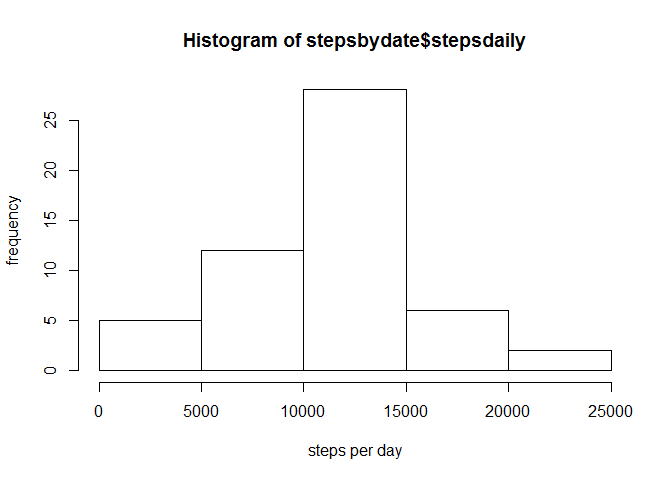
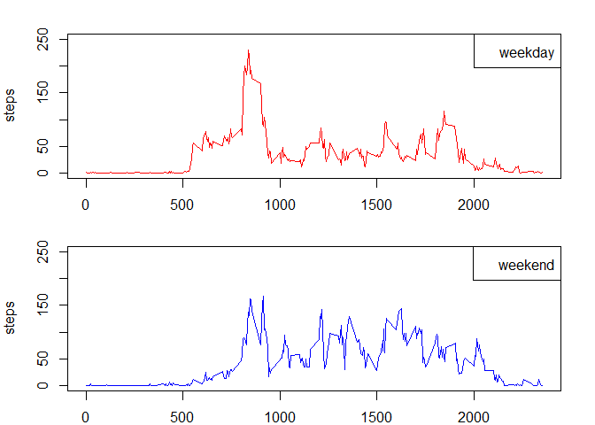

This is an R Markdown document. Markdown is a simple formatting syntax
for authoring HTML, PDF, and MS Word documents. For more details on
using R Markdown see <http://rmarkdown.rstudio.com>.

Loading and preprocessing the data
----------------------------------

Check if the file exists. if not then download from the URL

    library(knitr)

    ## Warning: package 'knitr' was built under R version 3.2.4

    library(dplyr)

    ## Warning: package 'dplyr' was built under R version 3.2.3

    ## 
    ## Attaching package: 'dplyr'

    ## The following objects are masked from 'package:stats':
    ## 
    ##     filter, lag

    ## The following objects are masked from 'package:base':
    ## 
    ##     intersect, setdiff, setequal, union

    library(lubridate)

    ## Warning: package 'lubridate' was built under R version 3.2.3

    if(!file.exists("activity.csv")) {
      temp <- tempfile()
      download.file("https://d396qusza40orc.cloudfront.net/repdata%2Fdata%2Factivity.zip",temp)
      file <- unzip(temp)
      unlink(temp)
    }else{
      file <- "./activity.csv"
    }

Read the Data

    data <- read.csv(file, header=TRUE, stringsAsFactors=FALSE, colClasses = c("numeric", "character",
                                                                             "integer"))
    data$date <- ymd(data$date)

What is mean total number of steps taken per day?
-------------------------------------------------

For this part of the assignment the missing values can be ignored.
Remove the NA values and use the dplyr package to group by date and
calculate the daily sum of steps

    stepsbydate <- data %>%
      filter(!is.na(steps)) %>%
      group_by(date) %>%
      summarize(stepsdaily = sum(steps)) 

Make a histogram of the total number of steps taken each day.

<!-- -->

Calculate and report the mean and median of the total number of steps
taken per day.

    mean_steps <- mean(stepsbydate$stepsdaily, na.rm = TRUE)

Mean =

    ## [1] 10766.19

    median_steps <- median(stepsbydate$stepsdaily, na.rm = TRUE)

Median =

    ## [1] 10765

What is the average daily activity pattern?
-------------------------------------------

Make a time series plot (i.e. type = "l") of the 5-minute interval
(x-axis) and the average number of steps taken, averaged across all days
(y-axis). Use dplyr package to calculate the mean per 5 minute interval
and plot it.

    stepsGroupedByInterval <- data %>%
      filter(!is.na(steps)) %>%
      group_by(interval) %>%
      summarize(stepsByInterval = mean(steps))

<!-- -->

Which 5-minute interval, on average across all the days in the dataset,
contains the maximum number of steps?.

    highInterval <- filter(stepsGroupedByInterval, stepsByInterval == max(stepsGroupedByInterval$stepsByInterval)) 

    ## Source: local data frame [1 x 2]
    ## 
    ##   interval stepsByInterval
    ##      (int)           (dbl)
    ## 1      835        206.1698

Imputing missing values
-----------------------

Fill in the NA values with the mean values for that time interval from
the data set that contains the mean steps by interval that was
calculated earlier.

    data_full <- data

    for(i in 1:nrow(data_full)){
      if(is.na(data_full[i,1])){
        data_full[i,1] <- filter(stepsGroupedByInterval, interval == data_full[i,3])$stepsByInterval
      }
    }

Group the filled in data set by date using the dplyr package

    stepsFullByDate <- data_full %>%
      filter(!is.na(steps)) %>%
      group_by(date) %>%
      summarize(stepsdaily = sum(steps))

Make a histogram of the total number of steps taken each day.

<!-- -->
Calculate and report the mean and median of the total number of steps
taken per day.

    mean_steps_full <- mean(stepsFullByDate$stepsdaily, na.rm = TRUE)

Mean =

    ## [1] 10766.19

    median_steps_full <- median(stepsFullByDate$stepsdaily, na.rm = TRUE)

Median =

    ## [1] 10766.19

Are there differences in activity patterns between weekdays and weekends?
-------------------------------------------------------------------------

Create a new factor variable in the dataset with two levels - "weekday"
and "weekend" indicating whether a given date is a weekday or weekend
day.

    data_full <- mutate(data_full, weektype = ifelse(weekdays(data_full$date) == "Saturday" | weekdays(data_full$date) == "Sunday", "weekend", "weekday"))
    data_full$weektype <- as.factor(data_full$weektype)

Use the dplyr package to group and sort by the interval and wekktype
filter the weekday and weekend data into separate data sets and select
only the interval and steps.

    full_data_by_interval_weektype <- data_full %>%
      group_by(interval, weektype) %>%
      summarize(stepsByInterval = mean(steps))

    dailyact_weekday <- full_data_by_interval_weektype %>%
      filter(weektype == "weekday") %>%
      select(interval, stepsByInterval)

    dailyact_weekend <- full_data_by_interval_weektype %>%
      filter(weektype == "weekend") %>%
      select(interval, stepsByInterval)

Plot the data for the weekday and the weekend and compare the average
steps.

<!-- -->
